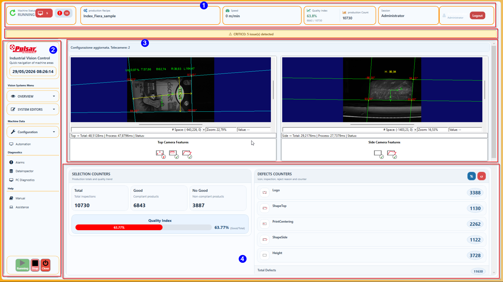
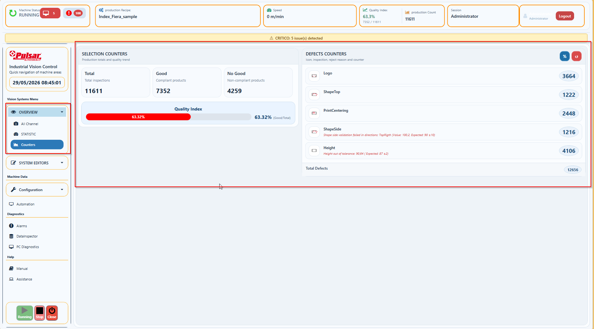
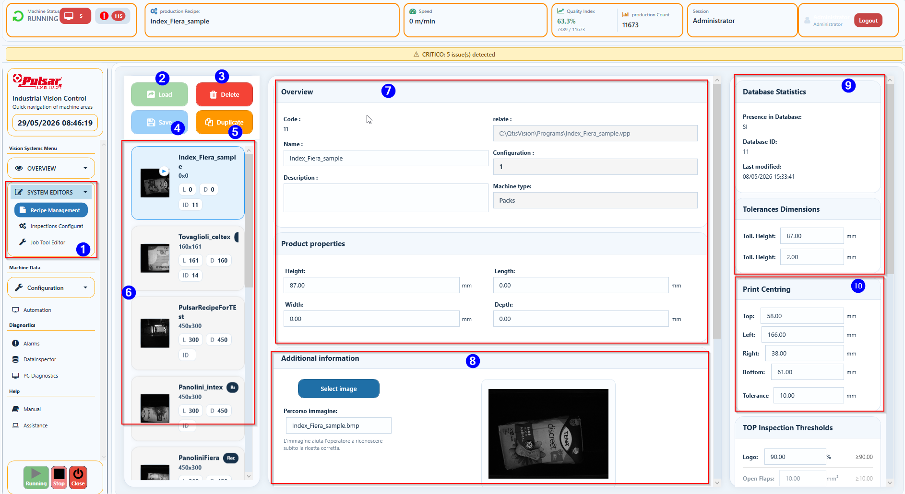
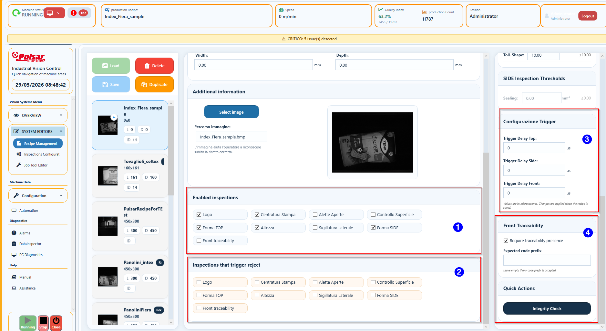
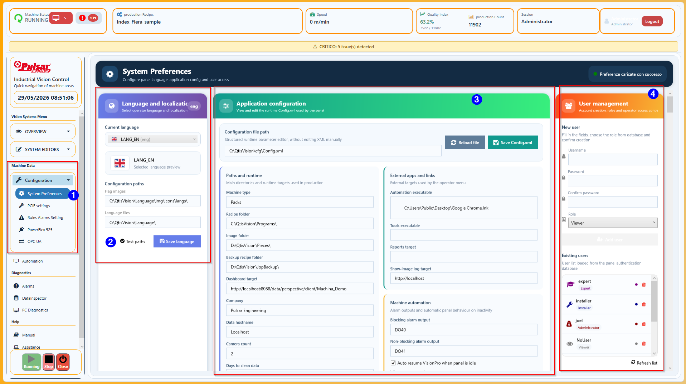
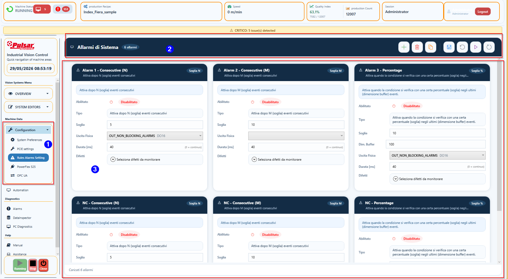
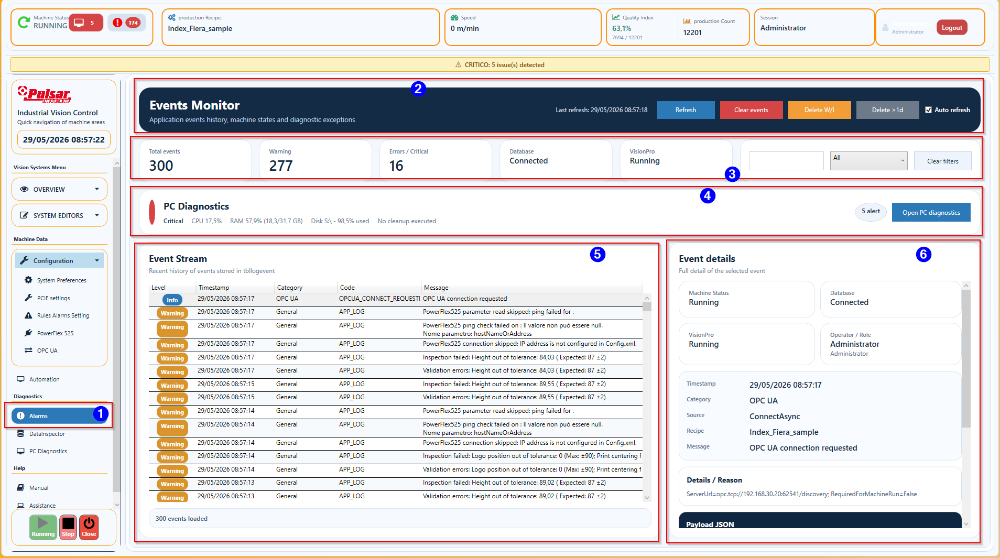
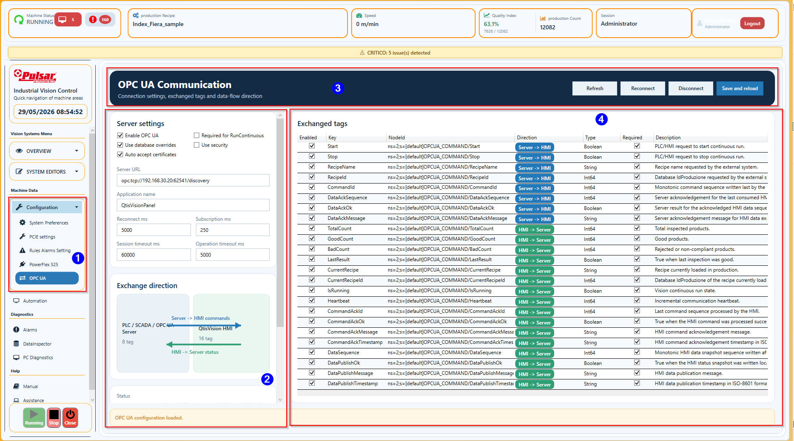
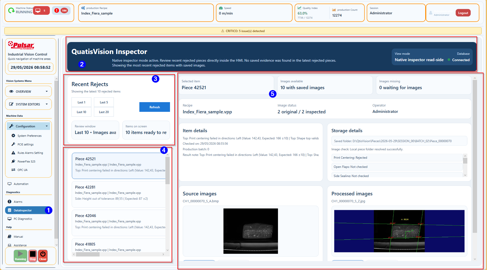
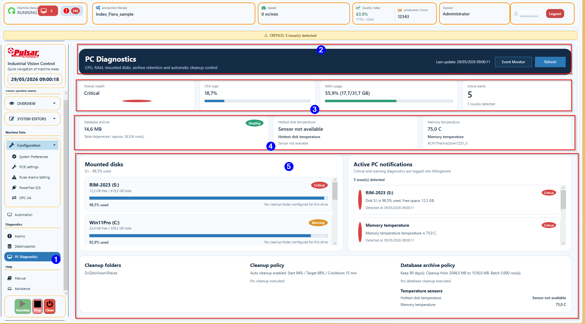

---
title: Manuale Operatore Qtis Vision Panel
description: Manuale canonico revisionato il 26/08/2026: schermate reali, funzioni, azioni operative, ruoli e condizioni di supporto.
image: Images/Main_window.png
image_caption: Schermata principale del pannello. I numeri indicano le aree operative spiegate nelle tabelle.
---

## Come leggere il manuale

| ID | Funzione | Cosa significa | Cosa fare | Quando chiamare supporto |
|---|---|---|---|---|
| 1 | Titolo pagina | Ogni sezione descrive una pagina del pannello o una procedura operativa. | Leggere prima il titolo, poi guardare l'immagine. | Se la pagina vista sul pannello non corrisponde al manuale. |
| 2 | Immagine | La schermata mostra i campi reali che l'operatore vede sulla macchina. | Confrontare l'immagine con il pannello prima di agire. | Se mancano pulsanti, menu o dati attesi. |
| 3 | Tabella funzioni | La tabella spiega campo per campo cosa significa e cosa fare. | Usare la colonna "Cosa fare" come procedura rapida. | Se la macchina non risponde come indicato. |
| 4 | Colonna supporto | Indica quando coinvolgere Expert, Installer, manutenzione o responsabile linea. | Non forzare comandi tecnici senza autorizzazione. | Sempre in caso di allarmi ripetuti, ricetta dubbia o macchina bloccata. |

## Ruoli e sicurezza operativa

| ID | Ruolo | Uso previsto | Non deve fare | Quando coinvolgerlo |
|---|---|---|---|---|
| 1 | Viewer | Consultazione Overview, statistiche, allarmi e manuale. | Modificare ricette, I/O o parametri macchina. | Per sola supervisione. |
| 2 | Operator | Produzione, cambio ricetta autorizzato, allarmi e manuale. | Forzare uscite, modificare job o commissioning. | Durante il normale turno di linea. |
| 3 | Expert | Taratura ricetta, diagnostica avanzata e job VisionPro. | Cambiare cablaggio o parametri di sicurezza senza procedura. | Per formato nuovo o anomalia visione. |
| 4 | Installer | Commissioning I/O, encoder, MultiShot, OPC UA e dispositivi. | Intervenire con macchina in moto se la pagina richiede stop. | Installazione e manutenzione qualificata. |
| 5 | Administrator | Utenti, configurazioni protette e amministrazione HMI. | Usare l'account come login ordinario di produzione. | Gestione accessi e recovery controllato. |
| 6 | Regola generale | La HMI non sostituisce le sicurezze elettriche della macchina. | Non bypassare ripari, emergenze o procedure LOTO. | Coinvolgere manutenzione per ogni rischio fisico. |

## Schermata principale

| ID | Funzione | Cosa significa | Cosa fare | Quando chiamare supporto |
|---|---|---|---|---|
| 1 | Machine Status | Stato macchina: RUNNING, STOPPED o runtime hold. | Verificare che sia RUNNING durante produzione. | Se resta in hold senza motivo chiaro. |
| 2 | Production Recipe | Ricetta attualmente caricata in produzione. | Controllare che corrisponda al prodotto sulla linea. | Se cambia da sola o non corrisponde al MES. |
| 3 | Speed | Velocita linea dalla sorgente configurata, normalmente in m/min; il throughput pz/min resta disponibile nella diagnostica encoder. | Verificare che il valore sia plausibile e stabile. | Se resta zero con nastro in marcia o mostra picchi anomali. |
| 4 | Quality Index | Percentuale pezzi buoni sul totale. | Monitorare cali improvvisi. | Se scende rapidamente o resta sotto il valore atteso. |
| 5 | Production Count | Totale pezzi ispezionati. | Verificare che aumenti mentre passano prodotti. | Se i prodotti passano ma il conteggio resta fermo. |
| 6 | Session | Utente e ruolo attivo. | Fare login con il ruolo corretto prima di operare. | Se mancano permessi per una funzione autorizzata. |
| 7 | Menu laterale | Navigazione tra Overview, editor, configurazioni, diagnostica e help. | Usare Overview, Counters, Alarms e Manual per operazioni normali. | Se compaiono pagine tecniche a utenti non autorizzati. |
| 8 | Immagini camere | Viste Top, Side/Left, Front, Rear/Right e Bottom con overlay di controllo. Fino a quattro viste sono disposte sulla prima riga. | Guardare se il prodotto e' ben visibile e dentro le guide. | Se immagine e salvataggio non corrispondono, una vista manca o il titolo non coincide con la camera fisica. |
| 9 | Feature camera | Icone verdi/rosse dei controlli immagine. | Verde = controllo conforme, rosso = controllo non conforme. | Se le feature sono verdi ma il prodotto viene scartato. |
| 10 | Selection Counters | Totale, Good, No Good e indice qualita'. Da release `3.0.1.0` si aggiornano live anche dopo navigazione pagina. | Usare per valutare andamento produzione. | Se i contatori non aumentano o si azzerano senza comando. |
| 11 | Defects Counters | Conteggio per difetto e ultimo motivo di scarto corrente. | Leggere il messaggio rosso solo quando il difetto e' attivo. | Se il messaggio resta su pezzi Good. |
| 12 | Start / Stop / Close | Comandi principali macchina e pannello. | Start avvia, Stop ferma, Close chiude HMI solo se autorizzati. | Se Start non riporta la macchina in RUNNING. |

## Avvio, stop e controllo produzione

| ID | Funzione | Cosa significa | Cosa fare | Quando chiamare supporto |
|---|---|---|---|---|
| 1 | Controllo ricetta | Prima condizione per produrre il prodotto corretto. | Verificare nome ricetta nella barra superiore. | Se la ricetta corretta non e' disponibile. |
| 2 | Controllo allarmi | Allarmi bloccanti o critici possono impedire il ciclo. | Leggere banner giallo e pagina Alarms prima di avviare. | Se un allarme ritorna dopo Acknowledge. |
| 3 | Controllo immagini | Le camere devono acquisire immagini coerenti. | Verificare che tutte le viste richieste dal VPP siano presenti; dalla quinta camera usare la seconda riga. | Se immagine nera, congelata, fuori posizione o associata al pannello sbagliato. |
| 4 | Start | Porta la macchina in RunContinuous quando non ci sono hold attivi. | Premere Start solo dopo controlli pre-avvio. | Se lo stato non passa a RUNNING. |
| 5 | Stop | Ferma intenzionalmente la macchina. | Usarlo per fermo manuale, manutenzione o cambio tecnico. | Se Stop non ferma il ciclo previsto. |
| 6 | Runtime hold | Pausa automatica per editor, salvataggi, job editor o condizioni tecniche. | Uscire dalla pagina tecnica e verificare ritorno a RUNNING. | Se resta hold dopo uscita dalla pagina. |
| 7 | Popup allarme | Notifica immediata di allarme scarto o condizione critica. | Leggere difetto, uscita e durata prima di Acknowledge. | Se il segnale fisico resta attivo dopo Acknowledge. |
| 8 | Popup timeout camera | Notifica warning non modale quando una camera companion non consegna il risultato entro timeout. | Verificare che le immagini camera continuino ad arrivare. | Se il popup si ripete o una camera resta senza immagine. |

## Counters

| ID | Funzione | Cosa significa | Cosa fare | Quando chiamare supporto |
|---|---|---|---|---|
| 1 | Total | Numero totale pezzi ispezionati. | Controllare che aumenti con il passaggio prodotti. | Se resta fermo in produzione. |
| 2 | Good | Pezzi conformi. | Usarlo per confermare produzione stabile. | Se Good non aumenta con controlli verdi. |
| 3 | No Good | Pezzi non conformi o scartati. | Monitorare aumenti anomali. | Se cresce velocemente o senza motivo visibile. |
| 4 | Quality Index | Percentuale Good / Total. | Verificare trend durante il turno. | Se cala improvvisamente. |
| 5 | Logo | Difetti logo, stampa o riconoscimento associato. | Leggere il messaggio rosso quando il difetto e' presente. | Se molti pezzi corretti risultano difettosi. |
| 6 | ShapeTop | Difetti di forma superiore. | Controllare prodotto e immagine Top. | Se overlay o tolleranze sembrano spostati. |
| 7 | PrintCentering | Difetti di centratura stampa. | Verificare posizione stampa sul prodotto. | Se tutte le stampe risultano fuori centro. |
| 8 | ShapeSide | Difetti forma laterale o sigillatura laterale. | Controllare immagine Side. | Se la camera laterale vede male il prodotto. |
| 9 | Height | Difetti altezza quando il controllo e' abilitato. | Verificare valore e tolleranza ricetta. | Se la misura e' instabile. |
| 10 | Classificazione AI | Contatore autonomo dei NOK prodotti dal Classify VisionPro; non appartiene a sealing o surface. | Verificare classe e score nella card della camera. | Se aumenta due volte sullo stesso pezzo o segue un altro controllo. |
| 11 | Pulsante percentuale | Cambia visualizzazione dove previsto. | Usarlo per analisi rapida dei difetti. | Se i valori non sono coerenti con i contatori. |
| 12 | Reset contatori | Azzera contatori solo con permessi adeguati. | Usarlo a inizio lotto o quando autorizzato. | Se reset non viene registrato o avviene da solo. |

Nota release `3.0.1.0`: i contatori Overview e top bar vengono aggiornati su evento ispezione completata. Se l'operatore esce e rientra dalla pagina Counters/Overview, la subscription viene ripristinata automaticamente.

Nota release `3.0.2.4`: i contatori difetto sono aggiornati una sola volta per famiglia difetto nel ciclo pezzo. Il conteggio pezzi `Total/Good/No Good` resta separato dal conteggio per-difetto, cosi un pezzo con un singolo difetto non deve piu aumentare due volte lo stesso contatore difetto.

## Recipe Management - scelta ricetta

| ID | Funzione | Cosa significa | Cosa fare | Quando chiamare supporto |
|---|---|---|---|---|
| 1 | Load | Carica la ricetta selezionata in produzione. | Controllare nome, immagine e dimensioni prima di premere. | Se la ricetta non viene caricata o non sale in cima lista. |
| 2 | Delete | Elimina una ricetta dal sistema. | Non usarlo in produzione normale. | Sempre se non si e' Expert/Installer. |
| 3 | Save | Salva modifiche alla ricetta. | Usarlo solo dopo modifica autorizzata. | Se la macchina resta in hold dopo salvataggio. |
| 4 | Duplicate | Crea una copia della ricetta. | Usarlo per varianti senza toccare l'originale. | Se serve nuova ricetta ufficiale. |
| 5 | Lista ricette | Elenco ricette disponibili. | La ricetta in produzione deve essere evidente e in alto. | Se la lista non mostra la ricetta attiva. |
| 6 | Immagine prodotto | Aiuta a riconoscere il prodotto corretto. | Confrontare immagine con prodotto in linea. | Se immagine non corrisponde alla ricetta. |
| 7 | Code / ID | Identificativi ricetta e database. | Comunicare ID quando si segnala un problema. | Se il cambio ricetta da OPC usa ID errato. |
| 8 | File VPP | File VisionPro associato alla ricetta. | Non modificarlo da operatore. | Se il job non viene trovato o non si carica. |
| 9 | Product properties | Dimensioni prodotto e parametri principali. | Controllare altezza, lunghezza, larghezza e profondita'. | Se prodotto reale non coincide con la ricetta. |
| 10 | Tolerances Dimensions | Tolleranze dimensionali. | Non cambiarle senza autorizzazione. | Se si hanno falsi scarti dimensionali. |
| 11 | Print Centring | Parametri di centratura stampa. | Verificare solo in caso di difetto PrintCentering. | Se la stampa reale e' buona ma viene scartata. |

## Recipe Management - ispezioni e trigger

| ID | Funzione | Cosa significa | Cosa fare | Quando chiamare supporto |
|---|---|---|---|---|
| 1 | Enabled inspections | Controlli eseguiti dal software. | Lasciare attivi i controlli previsti dalla ricetta. | Se un controllo necessario manca o non appare in Overview. |
| 2 | Reject inspections | Controlli che comandano scarto fisico. | Verificare che solo difetti previsti scartino il prodotto. | Se un difetto viene visto ma non scarta. |
| 3 | Trigger Delay Top | Ritardo acquisizione camera superiore. | Non modificarlo da operatore. | Se immagine Top viene presa troppo presto o tardi. |
| 4 | Trigger Delay Side | Ritardo acquisizione camera laterale. | Non modificarlo da operatore. | Se immagine Side e' fuori posizione. |
| 5 | Trigger Delay Front | Ritardo acquisizione camera frontale. | Non modificarlo da operatore. | Se tracciabilita' front non legge correttamente. |
| 6 | Require traceability | Richiede presenza codice quando attivo. | Controllare che il codice atteso sia leggibile. | Se codici corretti vengono respinti. |
| 7 | Expected code prefix | Prefisso codice accettato. | Verificare con il lotto in produzione. | Se MES o ricetta inviano prefisso errato. |
| 8 | Quick Actions | Controlli rapidi di integrita' ricetta. | Usare solo se autorizzati. | Se l'integrity check segnala errori. |
| 9 | Camera position offset | Correzione positiva/negativa della quota globale per il solo prodotto. | Modificare solo in commissioning ricetta e controllare i primi pezzi. | Se la quota corretta non viene applicata dopo il cambio ricetta. |
| 10 | Classificazione AI | Controllo VisionPro autonomo con flag separati per ispezione e scarto. | Expert/Installer: abilitare prima l'ispezione, collaudare GOOD/NOK, poi autorizzare lo scarto se richiesto. | Se una ricetta storica lo abilita da sola o se modifica sealing/surface. |
| 10 | MultiShot mode | Eredita, abilita o disabilita il profilo globale per la ricetta. | Usare `Machine` quando non serve una variante prodotto. | Se VisionPro riceve un numero frame inatteso. |
| 11 | Shot count / step delta | Corregge numero frame e distanza rispetto ai valori macchina. | Non modificare durata impulso o canale dalla ricetta. | Se la camera perde frame o lo stitching resta incompleto. |
| 12 | First-shot delta | Trasla l'intera sequenza MultiShot mantenendo lo step. | Usare per centrare la scansione del prodotto. | Se il primo e ultimo frame non coprono il prodotto. |
| 13 | Inspection Configuration per vista | Associa a ogni camera della ricetta soltanto i controlli prodotti dal suo ToolBlock. | Expert/Installer: scegliere `Machine`, `Enabled` o `Disabled`, spuntare gli output reali e salvare. | Se una camera disabilitata genera ancora timeout o una vista richiede output che non possiede. |
| 14 | Classi AI accettate per vista | Definisce le etichette Classify che valgono GOOD per ciascuna camera. | Copiare esattamente i nomi addestrati nel modello VisionPro e collaudare campioni noti. | Se classe, score ed esito macchina non sono coerenti. |
| 15 | Confidenza AI minima per vista | Definisce lo score minimo per accettare una classe GOOD; `0` disattiva la soglia. | Expert/Installer: tarare con campioni qualificati nella stessa scala del VPP. | Se compare `Unclassify` su campioni noti o lo score non usa la scala attesa. |
| 16 | Trigger per camera della ricetta | TOP, SIDE/LEFT, RIGHT e REAR hanno scelte distinte `Machine`, `Enabled`, `Disabled`; la scheda e il canale restano nel Setup macchina. | Con il VPP della ricetta caricato, impostare ogni camera richiesta e salvare. Una riga grigia indica che il ruolo non e' riconosciuto dal profilo ricetta o dal VPP attivo. | Se RIGHT o REAR risultano grigi pur essendo nel VPP, controllare il profilo viste e la mappa ruoli del job prima di forzare uscite. |

## System Preferences

| ID | Funzione | Cosa significa | Cosa fare | Quando chiamare supporto |
|---|---|---|---|---|
| 1 | Language | Lingua attiva del pannello. | Selezionare la lingua richiesta dal turno. | Se testi restano non tradotti o corrotti. |
| 2 | Configuration file path | Percorso del Config.xml macchina. | Non cambiarlo durante produzione. | Sempre prima di modificare path o file macchina. |
| 3 | Reload file | Ricarica configurazione da disco. | Usarlo solo dopo salvataggi controllati. | Se il pannello non legge il Config.xml. |
| 4 | Save Config.xml | Salva modifiche configurazione macchina. | Solo Expert/Installer. | Sempre se il cambio riguarda I/O, encoder o path. |
| 5 | Paths and runtime | Percorsi ricette, immagini, backup e dashboard. | Verificare se mancano file o immagini. | Se salvataggio immagini non usa la cartella attesa. |
| 6 | Machine automation | Uscite allarmi e opzioni automatiche. | Non modificare senza fermo e autorizzazione. | Se un segnale fisico non si comporta come previsto. |
| 7 | User management | Utenti e ruoli. | Usare account personale e fare logout a fine turno. | Se servono permessi nuovi o un utente resta bloccato. |

## Rules Alarms Setting

| ID | Funzione | Cosa significa | Cosa fare | Quando chiamare supporto |
|---|---|---|---|---|
| 1 | Enabled | Attiva o disattiva una regola allarme. | Non cambiare da operatore. | Se un allarme atteso non compare. |
| 2 | Alarm type | Tipo soglia: consecutivi, buffer o percentuale. | Leggere il tipo nel popup allarme. | Se popup compare troppo spesso o troppo tardi. |
| 3 | Threshold | Numero o percentuale che fa scattare l'allarme. | Non modificare in produzione normale. | Se serve taratura soglia. |
| 4 | Buffer size | Numero pezzi considerati per calcolo percentuale. | Verificare solo in collaudo. | Se l'allarme percentuale non torna. |
| 5 | Physical output | Uscita digitale associata all'allarme. | Leggere nel popup quale uscita e' comandata. | Se il segnale resta alto dopo Acknowledge. |
| 6 | Duration ms | Durata impulso uscita. Zero puo' essere reset manuale. | Premere Acknowledge dopo aver letto la causa. | Se Acknowledge non resetta evento e segnale. |
| 7 | Defects | Difetti monitorati dalla regola. | Verificare quale difetto ha generato l'allarme. | Se difetto sbagliato attiva l'allarme. |
| 8 | Save / Refresh / Test | Comandi tecnici di configurazione. | Usarli solo se autorizzati. | Se test uscita non corrisponde al cablaggio. |

## Events Monitor / Alarms

| ID | Funzione | Cosa significa | Cosa fare | Quando chiamare supporto |
|---|---|---|---|---|
| 1 | Event stream | Storico cronologico eventi macchina. | Leggere livello, ora, categoria e messaggio. | Se servono log per assistenza. |
| 2 | Refresh | Aggiorna elenco eventi. | Premere dopo un errore o cambio pagina. | Se eventi nuovi non compaiono. |
| 3 | Auto refresh | Aggiorna automaticamente la lista. | Tenerlo attivo durante diagnosi. | Se causa rallentamenti o non aggiorna. |
| 4 | Filters | Ricerca testuale e filtri categoria/stato. | Filtrare per OPC, allarmi, ricette o database. | Se serve ricostruire sequenza evento. |
| 5 | Database status | Stato connessione database. | Verificare in caso di mancato salvataggio. | Se database non connesso o errori MySQL. |
| 6 | VisionPro status | Stato runtime Cognex. | Verificare se non arrivano immagini o risultati. | Se VisionPro non e' RUNNING. |
| 7 | PC Diagnostics banner | Sintesi salute PC. | Aprire PC Diagnostics se appare Critical. | Se disco, CPU, RAM o temperatura sono critici. |
| 8 | Event details | Dettagli evento selezionato. | Comunicare ora, sorgente, ricetta e messaggio al supporto. | Sempre per errori ripetuti. |

## OPC UA Communication

| ID | Funzione | Cosa significa | Cosa fare | Quando chiamare supporto |
|---|---|---|---|---|
| 1 | Enable OPC UA | Abilita comunicazione verso MES, SCADA, PLC o Ignition. | Attivare solo se l'impianto usa OPC UA. | Se la connessione non parte. |
| 2 | Required for RunContinuous | Se attivo, OPC diventa vincolo per avviare la macchina. | Lasciarlo disattivo se OPC non deve bloccare produzione. | Se la macchina non parte per mancata comunicazione. |
| 3 | Use security | Usa security policy e certificati OPC UA. | Verificare certificati prima della connessione. | Se compaiono errori ApplicationCertificate o trust store. |
| 4 | Server URL | Endpoint OPC UA del server esterno. | Controllare indirizzo, porta e endpoint. | Se server Ignition/PLC non risponde. |
| 5 | Reconnect / Disconnect | Comandi connessione client. | Usare Reconnect dopo correzione configurazione. | Se riconnessione fallisce piu' volte. |
| 6 | Save and reload | Salva parametri e ricarica servizio OPC. | Usarlo dopo modifiche autorizzate. | Se i tag non si aggiornano dopo salvataggio. |
| 7 | Exchange direction | Disegno direzione dati HMI/server. | Capire quali tag arrivano dal server e quali partono dalla HMI. | Se un comando viene scritto nella direzione sbagliata. |
| 8 | RecipeName / RecipeId | Cambio ricetta da OPC per nome o ID database. | Verificare che il cambio venga notificato all'operatore. | Se ricetta richiesta non esiste. |
| 9 | CommandAck | Handshake di conferma comando. | Controllare CommandAckOk e CommandAckMessage. | Se il server non riceve conferma. |
| 10 | Heartbeat | Segnale vita comunicazione. | Verificare che cambi regolarmente. | Se heartbeat resta fermo. |
| 11 | Event log OPC | Stato connessione ed eventi OPC registrati nei log. | Aprire Alarms/Events in caso di problemi. | Se servono dettagli per MES o IT. |

## DataInspector

| ID | Funzione | Cosa significa | Cosa fare | Quando chiamare supporto |
|---|---|---|---|---|
| 1 | Recent Rejects | Carica gli ultimi scarti salvati. | Scegliere Last 1, 5, 10 o 20. | Se non vengono trovati scarti recenti. |
| 2 | Refresh | Ricarica dati e immagini. | Premere dopo uno scarto appena visto. | Se la lista non si aggiorna. |
| 3 | Lista pezzi | Schede dei pezzi scartati. | Selezionare il pezzo da verificare. | Se motivo o ricetta non coincidono. |
| 4 | Selected item | Dettaglio pezzo scelto. | Controllare numero pezzo, ricetta e motivo. | Se mancano dati principali. |
| 5 | Images available | Numero immagini trovate. | Verificare che ci siano originali e processate. | Se immagini attese mancano. |
| 6 | Source images | Immagini originali salvate. Da release `3.0.1.1` si possono aprire in zoom fullscreen con click sulla miniatura. | Confrontare con quanto visto in Overview; usare rotella mouse o pulsanti `+` / `-` per leggere dettagli piccoli. | Se sono diverse dal prodotto simulato/prodotto reale. |
| 7 | Processed images | Immagini con overlay e risultati. Da release `3.0.1.1` si possono aprire in zoom fullscreen con click sulla miniatura. | Usarle per capire perche' e' stato scartato; usare `1:1` per tornare alla scala reale. | Se overlay e risultato non sono coerenti. |
| 8 | Storage details | Cartella dove sono salvati i file. | Usarla per recuperare immagini dal disco. | Se il percorso e' errato o non accessibile. |
| 9 | Scarica evidenza | Esporta immagini disponibili e file `detail.txt` con dati pezzo/ispezione in una cartella scelta. | Usarlo quando serve inviare evidenza a qualita', manutenzione o supporto. | Se il pacchetto non viene creato o mancano immagini attese. |
| 10 | Zoom overlay | Vista fullscreen dell'immagine selezionata. | Chiudere con `X`; usare reset zoom se l'immagine non e' piu centrata. | Se lo zoom non apre o l'immagine appare vuota. |

## Data Analysis

| ID | Funzione | Cosa significa | Cosa fare | Quando chiamare supporto |
|---|---|---|---|---|
| 1 | Refresh | Aggiorna dashboard statistica. | Premere dopo aver cambiato filtri. | Se i dati non cambiano. |
| 2 | Esporta PDF | Crea un PDF con i soli grafici visualizzati. | Premere dopo aver impostato filtri e Refresh per archiviare l'analisi. | Se il PDF non viene creato o manca un grafico atteso. |
| 3 | Edit Dashboard | Modifica dashboard, riservato a ruoli tecnici. | Non usare da operatore. | Se serve aggiungere grafici o misure. |
| 4 | Filters | Data inizio, data fine e ricetta. | Selezionare periodo e prodotto da analizzare. | Se una ricetta non appare nei filtri. |
| 5 | Production overview | Barre Total, Good e NoGood. | Leggere il volume del periodo selezionato. | Se valori non coincidono con produzione. |
| 6 | Defect distribution | Distribuzione difetti. | Individuare difetto principale. | Se un difetto domina senza causa visibile. |
| 7 | Height trend | Andamento misura con nominale e tolleranza. | Cercare derive lente o instabilita'. | Se valori superano tolleranza o oscillano. |
| 8 | Updated | Ora ultimo aggiornamento. | Verificare che sia recente. | Se resta vecchio dopo Refresh. |

## PC Diagnostics

| ID | Funzione | Cosa significa | Cosa fare | Quando chiamare supporto |
|---|---|---|---|---|
| 1 | Overall health | Stato complessivo PC. | Verificare che sia OK o Warning gestibile. | Se diventa Critical. |
| 2 | CPU load | Carico processore. | Osservare durante rallentamenti. | Se resta alto a lungo. |
| 3 | RAM usage | Memoria usata. | Controllare se il pannello rallenta. | Se supera soglie o cresce continuamente. |
| 4 | Active alerts | Numero avvisi PC attivi. | Leggere elenco notifiche. | Se gli alert non rientrano. |
| 5 | Mounted disks | Spazio dischi. | Verificare disco immagini e database. | Se un disco e' quasi pieno. |
| 6 | Temperature CPU / disco / sistema | Temperature hardware disponibili sul PC. La scritta `Sensor not available` significa che BIOS, controller o driver non espongono quella misura. | Controllare che i valori restino sotto le soglie; non interpretare un sensore assente come temperatura zero. | Se una card diventa Warning/Critical, se il PC si spegne per temperatura o se un sensore prima disponibile scompare. |
| 7 | Cleanup folders | Cartelle gestite da pulizia automatica. | Non cancellare manualmente file macchina. | Se lo spazio non si libera. |
| 8 | Database archive policy | Regole archivio database. | Consultare se database cresce. | Se archivio fallisce o genera warning. |

## Regole operative rapide

### Setup macchina: collegamento DI/DO

Nel pannello PCIE apri **Setup macchina**. La sezione **Collega ingressi e uscite** mostra subito due tabelle, una per DI e una per DO: imposta scheda, canale, polarita' e uso del segnale fisico, poi usa **Salva configurazione** in alto. Il salvataggio aggiorna il file runtime macchina gia' in uso; non serve ripetere la mappatura nelle tabelle avanzate. Per i punti di intervento imposta il segnale e la quota nell'editor sottostante. Apri le sezioni avanzate solo per binding, dettagli dei segnali, encoder e backup.

Prima di abilitare un punto di intervento, verifica su macchina ferma che ogni uscita azioni il dispositivo previsto e che due funzioni non condividano accidentalmente lo stesso canale.

| ID | Funzione | Cosa significa | Cosa fare | Quando chiamare supporto |
|---|---|---|---|---|
| 1 | Cambio turno | Passaggio responsabilita' tra operatori. | Fare logout/login e controllare ricetta. | Se l'utente non riesce ad accedere. |
| 2 | Cambio ricetta manuale | Selezione ricetta da Recipe Management. | Caricare solo ricette autorizzate e controllare primi pezzi. | Se prodotto e ricetta non coincidono. |
| 3 | Cambio ricetta OPC | Ricetta cambiata da MES o server OPC UA. | Leggere popup/notifica e controllare barra superiore. | Se la ricetta cambia senza richiesta nota. |
| 4 | Allarme popup | Evento critico o scarto con soglia. | Leggere messaggio, uscita e difetto prima di Acknowledge. | Se ritorna subito dopo Acknowledge. |
| 5 | Difetti in crescita | Aumento No Good o difetti specifici. | Aprire Counters e DataInspector. | Se il difetto e' ripetitivo o non reale. |
| 6 | Mancata partenza | Start non porta RUNNING. | Controllare Stop manuale, hold, allarmi, OPC required e VisionPro. | Se il blocco resta dopo controlli base. |
| 7 | Chiusura HMI | Arresto interfaccia pannello. | Usare Close solo se autorizzato e non durante produzione. | Se la macchina deve restare disponibile. |
