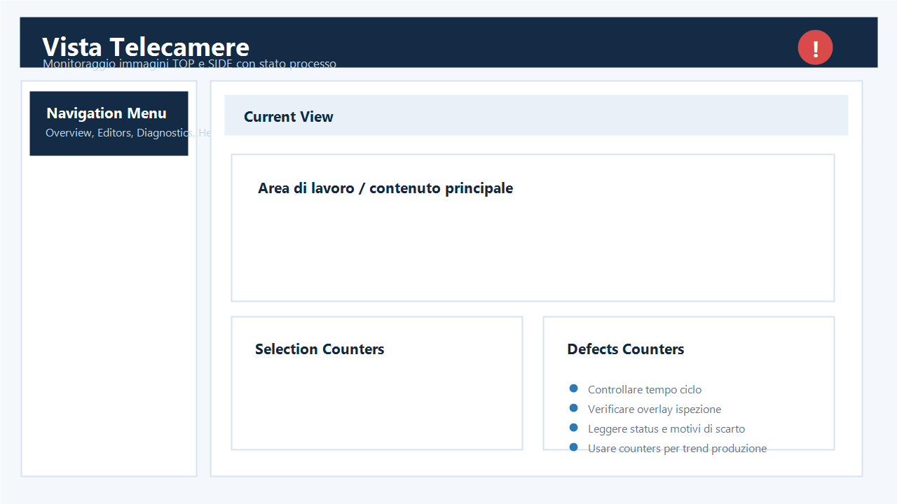

## Schermata principale

| ID | Funzione | Cosa significa | Cosa fare | Quando chiamare supporto |
|---|---|---|---|---|
| 1 | Machine Status | Stato `RUNNING`, `STOPPED` o hold runtime. | In produzione verificare `RUNNING`. | Se resta in hold dopo avere lasciato una pagina tecnica. |
| 2 | Production Recipe | Ricetta realmente caricata nel runtime. | Confrontare nome e prodotto in linea. | Se non coincide con il formato o cambia senza richiesta. |
| 3 | Speed | Velocita linea letta dalla sorgente configurata, normalmente in m/min. | Verificare che sia plausibile e stabile. | Se e zero con nastro in moto o mostra picchi anomali. |
| 4 | Quality Index | Rapporto Good/Total. | Osservare variazioni improvvise. | Se cala senza difetti visibili. |
| 5 | Production Count | Pezzi realmente chiusi dal ciclo ispezione. | Verificare un incremento per prodotto. | Se aumenta senza prodotto o resta fermo. |
| 6 | Session | Utente e ruolo attivi. | Usare il proprio account. | Se un ruolo vede comandi non autorizzati. |
| 7 | Notification bar | Avvisi macchina, MES/OPC UA ed eventi critici. | Leggere il testo prima di agire. | Se un evento critico resta attivo senza causa chiara. |
| 8 | Navigation menu | Accesso alle pagine consentite dal ruolo. | Per produzione usare Overview, Counters, Alarms e Manual. | Se mancano pagine previste per il ruolo. |
| 9 | Camera views | Ultima immagine valida e overlay VisionPro. | Controllare aggiornamento e centratura prodotto. | Se l'immagine e nera, ferma o della ricetta precedente. |
| 10 | Camera features | Stato dei singoli controlli. | Verde = conforme; rosso = difetto corrente. | Se gli stati non coincidono con l'esito finale. |
| 11 | Counters | Total, Good, No Good e difetti. | Verificare coerenza tra pezzi ed esiti. | Se un difetto aumenta due volte per pezzo. |
| 12 | Start / Stop / Close | Comandi principali. | Usare Close solo con ruolo tecnico e macchina ferma. | Se Start non porta il runtime in marcia. |
| 13 | Classificazione AI | Card con icona AI, classe e score quando il job VisionPro espone il controllo. | Leggere badge e classe insieme all'immagine. | Se la card non compare, resta vecchia o mostra dati della camera errata. |

## Disposizione delle telecamere

| ID | Numero camere | Disposizione normale | Cosa verificare |
|---|---|---|---|
| C1 | 1 | Una vista a tutta larghezza. | Il titolo coincide con il job attivo. |
| C2 | 2 | Due viste sulla stessa riga. | Entrambe si aggiornano sullo stesso prodotto. |
| C3 | 3 | Tre viste sulla stessa riga quando lo spazio lo consente. | Nessun pannello risulta tagliato. |
| C4 | 4 | Quattro viste sulla prima riga. | Top, Left, Right e Bottom sono distinti. |
| C5 | 5 o piu' | Prime quattro sulla prima riga; le successive sulla seconda. | Usare lo scorrimento verticale, non deve servire quello orizzontale. |

Le viste si ridimensionano automaticamente. Su uno schermo molto stretto la
HMI riduce le colonne per mantenere leggibili immagini e indicatori. `Left` e
`Right` devono comparire con il proprio nome; la loro assenza indica un job VPP,
una configurazione camera o una FIFO da verificare con il manutentore.

## Controllo inizio turno

| ID | Passo | Esito atteso | Azione se non conforme |
|---|---|---|---|
| A | Login | Nome e ruolo corretti nella top bar. | Fare logout e accedere con il proprio utente. |
| B | Ricetta | Nome uguale al prodotto da lavorare. | Fermare e caricare la ricetta autorizzata. |
| C | Stato | Nessun allarme bloccante. | Aprire Alarms e leggere la causa. |
| D | Immagini | Tutte le camere del VPP attivo sono visibili. | Controllare trigger, VisionPro e collegamenti camera. |
| E | Primo pezzo | Un solo incremento Total e immagine corretta. | Fermare se conteggio, scarto o immagine non sono coerenti. |
