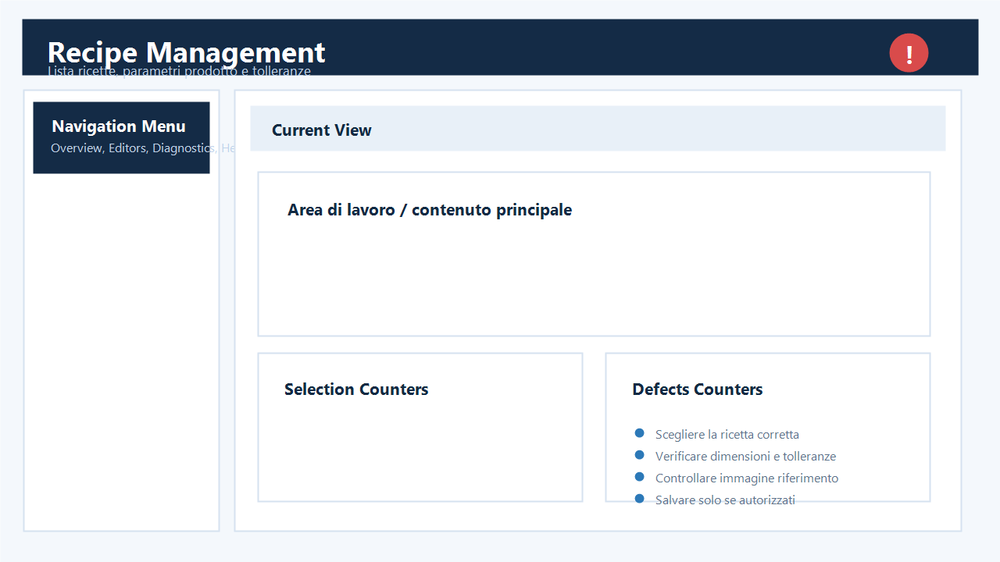
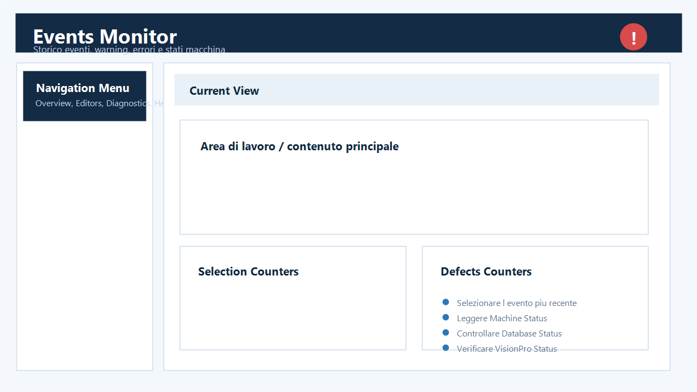

## Gestione ricetta

| ID | Funzione | Cosa significa | Cosa fare | Quando chiamare supporto |
|---|---|---|---|---|
| 1 | Ricetta in produzione | E mostrata per prima e identificata come attiva. | Verificare nome, immagine e dimensioni. | Se l'indicatore attivo e sulla ricetta sbagliata. |
| 2 | Load | Carica la ricetta selezionata nel runtime. | Usare solo a macchina in condizione consentita. | Se il VPP non viene caricato. |
| 3 | Save | Salva parametri ricetta modificabili dal ruolo. | Controllare i valori prima della conferma. | Se il salvataggio non persiste al riavvio. |
| 4 | Product properties | Dimensioni nominali del formato. | Confrontare con scheda prodotto. | Se valori validi vengono rifiutati o azzerati. |
| 5 | Enabled inspections | Controlli VisionPro richiesti dal prodotto. | Abilitare solo quelli presenti nel job. | Se un controllo abilitato non ha output VisionPro. |
| 6 | Camera offsets | Correzioni positive/negative solo per questa ricetta. | Usare il riepilogo Globale/Effettivo; non compensare un errore comune a tutte le ricette. | Se il valore macchina globale non e disponibile. |
| 7 | MultiShot corrections | Delta scatti, step e primo scatto per prodotto. | Lasciare `Use machine setting` se non serve una correzione. | Se la camera perde frame o lo stitching non chiude. |
| 8 | Responsive layout | Su monitor piccoli i parametri passano sotto il pannello principale. | Scorrere nella stessa pagina; nessun dato viene nascosto. | Se una sezione non e raggiungibile. |

## Allarmi ed eventi

| ID | Funzione | Cosa significa | Cosa fare | Quando chiamare supporto |
|---|---|---|---|---|
| 1 | Livello | Info, warning, error o critical. | Dare priorita a error e critical. | Se lo stesso evento ritorna a ogni prodotto. |
| 2 | Dettaglio | Causa tecnica, ricetta, stato macchina e VisionPro. | Annotare testo e orario completi. | Se il dettaglio e vuoto o incoerente. |
| 3 | Popup allarme scarto | Soglia difetto raggiunta e uscita associata. | Leggere difetto e canale prima di Acknowledge. | Se l'uscita non si resetta o il popup ritorna subito. |
| 4 | Acknowledge | Conferma presa visione e reset della regola allarme. | Premere dopo avere verificato la causa. | Se contatore evento o segnale restano attivi. |
| 5 | MES / OPC UA | Cambio ricetta o comando remoto notificato. | Controllare il prodotto dopo il cambio. | Se il cambio non era previsto dalla linea. |

## Richiesta assistenza

| ID | Informazione | Cosa raccogliere | Perche serve |
|---|---|---|---|
| A | Ricetta | Nome esatto e ID database se visibile. | Riprodurre configurazione e parametri. |
| B | Evento | Screenshot, testo e orario preciso. | Cercare la stessa finestra nei log. |
| C | Camera | Nome Top, Left/Side, Right/Rear, Bottom o Front. | Isolare acquisizione e output VisionPro. |
| D | Prodotto | Immagine originale/processata da DataInspector. | Verificare posizione, luce e difetto. |
| E | Stato | RUNNING/STOPPED, velocita, board, DB e OPC UA. | Separare problema macchina, rete o visione. |
