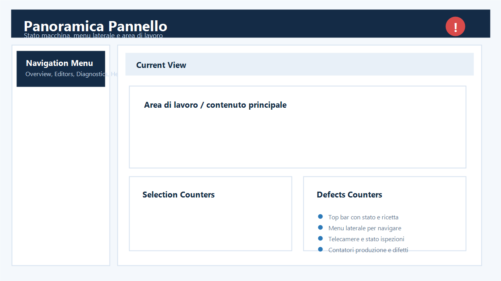

## Accesso e funzioni

| ID | Funzione | Cosa significa | Azione | Vincolo |
|---|---|---|---|---|
| 1 | Stato comunicazione | Drive raggiungibile, non disponibile o disabilitato. | Premere Aggiorna e leggere IP/stato. | Non blocca la produzione se non configurato come requisito esterno. |
| 2 | Monitor | Frequenza, corrente, tensione, bus DC e potenza. | Usare per diagnosi, senza modificare valori. | Lettura tecnica. |
| 3 | Parametri motore | Dati nominali e rampe del drive. | Confrontare vecchio e nuovo valore. | Expert/Installer; alcuni richiedono drive fermo. |
| 4 | Applica | Scrive le modifiche pendenti. | Confermare solo dopo verifica macchina. | Comando protetto e tracciato. |
| 5 | Reset fault | Invia il reset dopo rimozione della causa. | Verificare prima il codice fault. | Non usare per nascondere un guasto ricorrente. |
| 6 | Speed factor K | Conversione Hz in m/min. | Tarare con misura reale in commissioning. | Salvare una volta, poi verificare al riavvio. |
| 7 | Storico | Modifiche locali e DB, se disponibile. | Consultare per ricostruire gli interventi. | Il DB non deve bloccare il ciclo. |

## Scopo

La pagina `PowerFlex 525` permette ai ruoli tecnici di controllare l'inverter del nastro senza rendere il funzionamento della macchina dipendente dalla comunicazione con il drive.

La vista e disponibile da `Setting -> PowerFlex 525` per:

- `Administrator`
- `Installer`
- `Expert`

## Configurazione richiesta

L'indirizzo IP non viene scritto nel codice: deve essere configurato nel `Config.xml`, sezione `PowerFlex525`.

Campi principali:

- `Enabled`: abilita o disabilita la lettura inverter.
- `IpAddress`: indirizzo IP del PowerFlex 525.
- `TimeoutMs`: tempo massimo di risposta prima di considerare il drive non disponibile.
- `PollIntervalMs`: intervallo di aggiornamento pagina.
- `HistoryFilePath`: file JSON locale dello storico modifiche.
- `MetersPerMinutePerHz`: fattore diretto Hz -> m/min usato dal pannello per calcolare la velocita.
- `Configuration.AutoLoginAdministratorForDemo`: se impostato a `true`, il pannello parte direttamente come `Administrator` per uso demo/fiera.

Se il drive non risponde o la sezione non e completa, la macchina continua a funzionare come prima: la vista mostra `non disponibile` e non blocca il ciclo.

## Lettura parametri

La vista mostra:

- monitor: `b001` frequenza, `b003` corrente, `b004` tensione, `b005` DC bus, `b017` potenza;
- diagnostica fault: `b006` stato drive, `b007` fault attivo, `b008` e `b009` ultimi fault storici;
- motore: `P031` fino a `P037`;
- rampe e limiti: `P041`, `P042`, `P043`, `P044`;
- gruppo `Modified M`: parametri del drive cambiati rispetto al default, quando l'adapter CIP validato espone questo dato;
- velocita nastro in `m/min`, calcolata come `b001 x fattore K`.

Prima della lettura dei parametri il pannello esegue un `ping` verso l'inverter:

- se il dispositivo non risponde, la vista notifica `Ping inverter non risponde`;
- la lettura CIP non parte;
- la macchina continua a funzionare senza blocchi.

Se `MetersPerMinutePerHz` non e ancora configurato, il pannello non inventa la conversione in `m/min` e lascia la velocita non disponibile finche il fattore K non viene inserito.

## Modifica parametri

1. Aprire `Setting -> PowerFlex 525`.
2. Premere `Aggiorna` e verificare stato drive e IP.
3. Modificare solo i parametri editabili.
4. Controllare la lista `Modifiche pendenti`, che mostra `vecchio -> nuovo`.
5. Premere `Applica` solo dopo verifica macchina.
6. Usare `Annulla` per scartare modifiche non applicate.
7. Usare `Ripristina` per svuotare i campi editabili prima di reimpostarli.
8. Usare `Reset fault` per inviare `A551 = 1` quando la causa del fault e stata rimossa.
9. Usare `Azzera storico fault` per inviare `A551 = 2` e pulire il buffer fault del drive.
10. Usare la card `Speed factor K` per salvare direttamente da pannello il valore `Metri/min per Hz`.

## Come rilevare i parametri velocita

### Metodo 1: fattore diretto `MetersPerMinutePerHz`

E il metodo piu semplice in collaudo.

1. Leggere sul pannello la frequenza reale `b001`.
2. Misurare la velocita reale del nastro in `m/min`.
3. Calcolare:

`MetersPerMinutePerHz = velocita_reale_m_min / frequenza_b001_hz`

Esempio:

- `b001 = 50 Hz`
- velocita nastro misurata = `6.5 m/min`
- `MetersPerMinutePerHz = 6.5 / 50 = 0.13`

Se compili questo valore, il pannello usa direttamente quel fattore e non ha bisogno di diametro/rapporto.

Per sicurezza, i parametri `P031`, `P032`, `P036`, `P043` e `P044` sono marcati come `RequiresStop`: se il drive risulta in marcia, `Applica` resta disabilitato.

## Storico

Ogni tentativo di modifica viene registrato:

- nel file JSON configurato in `HistoryFilePath`;
- nella tabella MySQL `tblpowerflex525_history`, quando il database e disponibile.

Se il database non e raggiungibile, il salvataggio DB viene saltato senza bloccare la vista e resta disponibile lo storico locale.

## Log e diagnostica

Da release `3.0.0.9` i log PowerFlex sono piu adatti alla produzione:

- i frame raw EtherNet/IP/CIP non vengono piu scritti a livello `Info`;
- il messaggio `CIP monitor read completed` viene registrato al massimo una volta al minuto se il numero di parametri disponibili non cambia;
- se il numero di parametri disponibili cambia, il log viene scritto subito per segnalare degradazione o ripristino comunicazione;
- per diagnosi driver approfondita, il manutentore puo portare temporaneamente NLog a `Debug`.

Questo non cambia la lettura parametri e non rende il PowerFlex vincolante per il ciclo macchina.

## Note per collaudo

Durante il collaudo verificare:

- ping/porta EtherNet/IP del drive su `44818`;
- correttezza di `P032 Motor NP Hertz`: il pannello ora lo visualizza come valore nominale reale del drive, senza scalatura errata;
- correttezza del fattore `MetersPerMinutePerHz`;
- che la velocita del top bar non sia piu randomica;
- che la pagina resti apribile anche con drive scollegato;
- che la pagina non tenti la lettura CIP se il `ping` e negativo;
- che i parametri `RequiresStop` non siano applicabili con drive in `RUN`;
- che i comandi `Reset fault` e `Azzera storico fault` vengano tracciati nei log e nello storico locale/DB;
- che la card `Speed factor K` aggiorni davvero `Config.xml`;
- che i log PowerFlex non siano floodati da frame CIP raw durante il polling normale.
