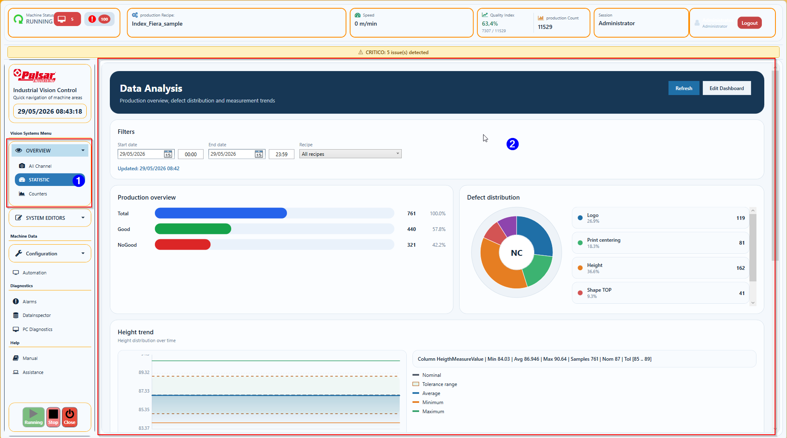

## Pagina Data Analysis

| ID | Funzione | Cosa significa | Cosa fare | Quando chiamare supporto |
|---|---|---|---|---|
| 1 | Start / End date | Intervallo temporale della query. | Selezionare un periodo coerente. | Se il periodo valido restituisce sempre zero dati. |
| 2 | Recipe | Filtro ricetta disponibile nel periodo. | Usare `Solo ispezioni della ricetta attiva` per la produzione corrente; usare `Tutte le ricette` solo per il totale macchina. | Se una ricetta prodotta non appare. |
| 3 | Refresh | Ricarica i dati senza modificare il ciclo. | Premere dopo ogni cambio filtro. | Se l'ora di aggiornamento non cambia. |
| 4 | Production overview | Total, Good e No Good. | Confrontare volumi e qualita. | Se non coincide con lo storico produzione. |
| 5 | Defect distribution | Peso dei difetti abilitati. | Individuare la causa dominante. | Se mancano categorie attese. |
| 6 | Measure trends | Min, media, max, nominale e tolleranza. | Cercare deriva o instabilita. | Se le misure sono fuori scala. |
| 7 | Esporta PDF | Crea un report dei soli grafici visibili. | Aggiornare prima i filtri, poi esportare. | Se il PDF e vuoto o taglia i grafici. |
| 8 | Edit Dashboard | Personalizzazione layout. | Usare solo come Administrator. | Se il layout salvato non viene ricaricato. |

## Scopo

La pagina `Data Analysis` mostra grafici produzione e misura usando i dati gia presenti nel database macchina, senza influire sul ciclo ispezione.

La vista e disponibile dal menu:

- `Overview -> Data Analysis`

La consultazione e disponibile per tutti i ruoli autorizzati alla vista. La modifica del layout e dei colori e riservata a `Administrator`.

## Dati mostrati

La pagina usa per default:

- `Start date`: oggi alle `00:00`
- `End date`: ora corrente
- `Recipe`: `Solo ispezioni della ricetta attiva`

Il filtro ricetta distingue:

- `Solo ispezioni della ricetta attiva`: limita i dati alla ricetta in produzione e mostra soltanto
  le ispezioni abilitate e realmente disponibili nel runtime/VPP
- `Tutte le ricette`: aggrega intenzionalmente tutte le produzioni nel periodo, anche se appartengono
  a famiglie di ispezione differenti
- nome ricetta: limita i dati alla singola ricetta archiviata selezionata

I dati vengono aggiornati:

- manualmente con `Refresh`
- automaticamente ogni `5` minuti

## Card disponibili

Le card standard sono:

- `Production overview`: barre `Total`, `Good`, `NoGood`
- `Defect distribution`: grafico difetti filtrato sulle ispezioni abilitate nella ricetta selezionata
- `Height trend`
- `3D height trend`
- `3D width trend`
- `3D length trend`

Per le ricette senza una misura abilitata, la relativa card trend resta nascosta o mostra che l'ispezione non e disponibile.

La lettura misure usa una mappa colonne compatibile con lo storico DB macchina:

- `Height trend`: prova `HeightMeasureValue`, poi `HeigthMeasureValue`
- `3D height trend`: `ThreeDHeightMeasureValue`
- `3D width trend`: `ThreeDWidthMeasureValue`
- `3D length trend`: `ThreeDLengthMeasureValue`

Se una colonna non esiste nel database locale, la card non forza errori runtime e mostra che la colonna misura non e disponibile.

## Uso operatore

1. Aprire `Overview -> Data Analysis`.
2. Impostare intervallo date.
3. Se serve, selezionare una ricetta tra quelle realmente presenti nel periodo scelto.
4. Premere `Refresh`.
5. Se serve archiviare il risultato, premere `Esporta PDF`: il file contiene solo i grafici visualizzati, con intestazione, periodo e ricetta selezionata.
6. Leggere:
   - barra produzione per volume e scarti
   - torta difetti per peso relativo dei difetti
   - trend `Min / Avg / Max` per dispersione misura nel tempo
   - linea nominale e fascia tolleranza per capire subito se la deriva resta dentro specifica

## Funzioni Administrator

Solo `Administrator` puo:

- aggiungere una card nascosta con `Add graph`
- rimuovere una card con `Remove`
- cambiare i colori delle tre barre produzione
- salvare il layout con `Save dashboard`

Le impostazioni layout sono salvate nel `Config.xml`, sezione `AnalyticsDashboard`.

## Note tecniche operative

- Le query sono asincrone e leggono solo il range richiesto.
- Il refresh periodico e lento intenzionalmente per non pesare sul runtime.
- La pagina non modifica ricette, esiti o ciclo macchina.
- Il filtro difetti della ricetta attiva combina abilitazioni ricetta e feature runtime/VPP; le
  categorie con conteggio zero non vengono disegnate nella torta.
- L'export PDF non modifica dati macchina: cattura i grafici visibili e li impagina in formato A4 orizzontale, fino a due grafici per pagina e su piu pagine se necessario.
- Quando disponibile, la pagina usa uno snapshot analytics gia presente in memoria per mostrare subito l'ultima fotografia del dashboard e poi aggiorna i dati in background.
- Il resolver ricetta analytics accetta solo file `.xml` validi con root `Recipedata`, cosi vengono esclusi file non ricetta o formati non supportati.
- I trend mostrano:
  - asse X con orari dei bucket
  - asse Y con valori misura
  - linea nominale
  - fascia tolleranza superiore/inferiore
- I riferimenti nominale/tolleranza arrivano dalla ricetta selezionata:
  - `Height trend`: `recipeParamSide.Min_Heigth_value` e `recipeParamSide.Heigth_toll`
  - `3D height/width/length`: valori `recipeParamTop3D`
